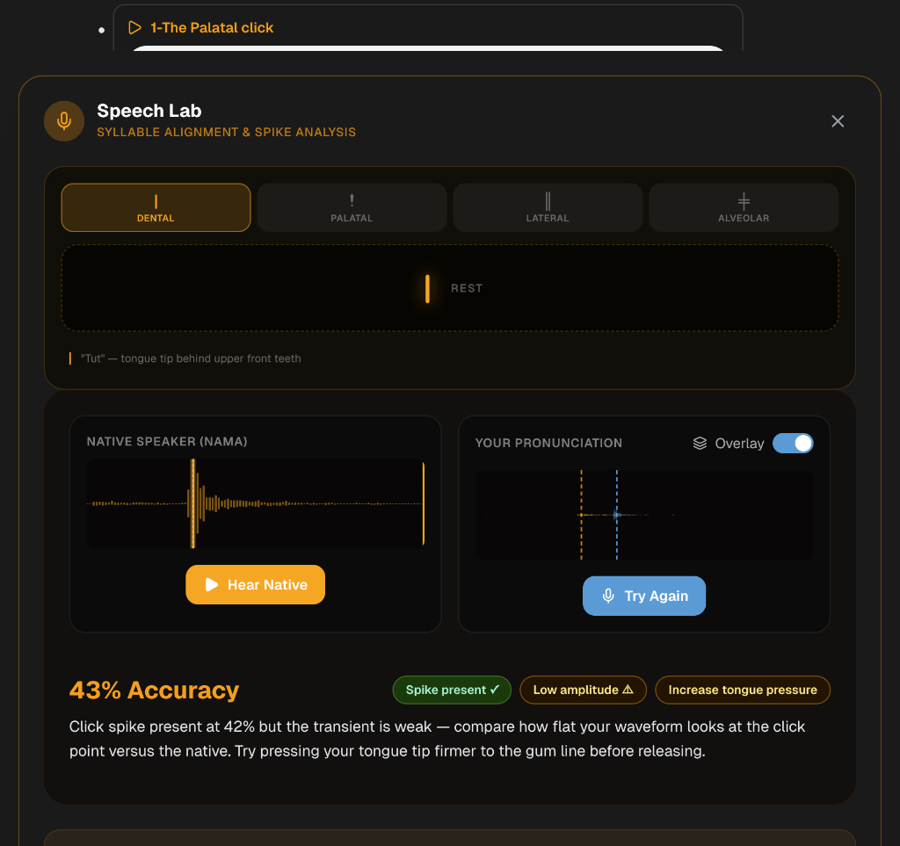
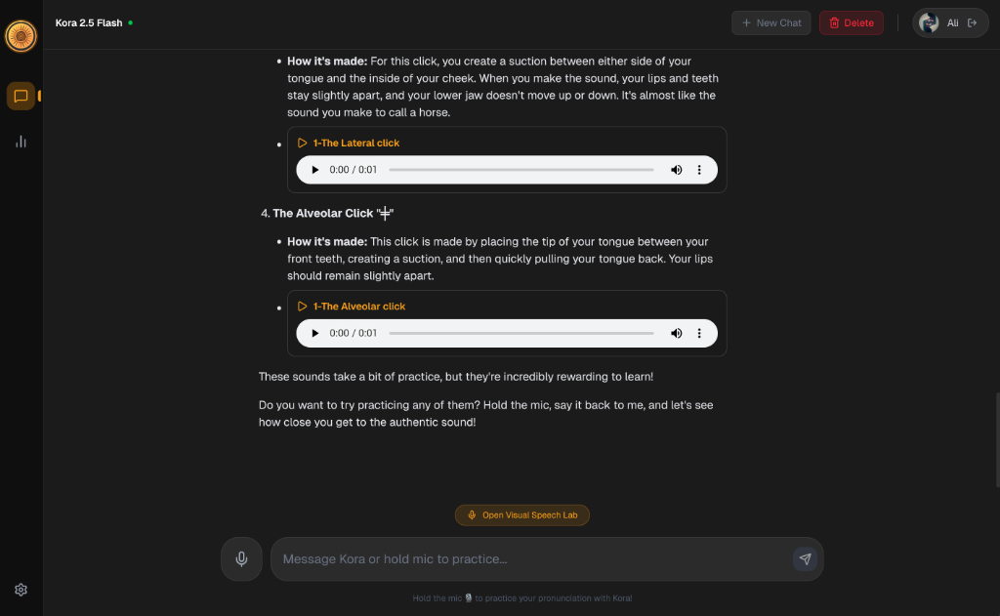

# 🤖 AI Changelog — Kora-Tutor

> Auto-maintained by GitHub Actions. Each entry reflects a versioned push to the main branch.
> Newest entries appear first. Do not edit manually.

---

## 2026-04-20 — Local Test Validation
- Localhost UI and functionality tested successfully.
- Visual Speech Lab and Chat Interface rendering interactively.
- WaveSurfer.js rendering waveform correctly with real-time feedback processing.
- Progress checkpoints saved:
  - 
  - 

## v1.1.0 — 2026-04-01
- Infrastructure standardization: MACP v2.0 deployment
- Initialized AI_CHANGELOG.md
- Configured real-time sync with Namka Control
- Automated versioning workflows
